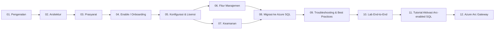

# Seri Belajar: Azure Arc-enabled SQL Server

Seri pembelajaran lengkap, dari konsep dasar sampai implementasi end-to-end, untuk **SQL Server enabled by Azure Arc**. Disusun berdasarkan dokumentasi resmi [Microsoft Learn](https://learn.microsoft.com/sql/sql-server/azure-arc/overview).

> Bahasa: Indonesia · Format: Markdown + Mermaid · Target audiens: DBA, IT Pro, Cloud Engineer yang ingin menghubungkan SQL Server on-premises / multi-cloud ke Azure.


## Peta Pembelajaran



## Daftar Modul

| # | Modul | Deskripsi |
|---|-------|-----------|
| 01 | [Pengenalan Azure Arc & Arc-enabled SQL](modules/01-pengenalan.md) | Apa itu Azure Arc, kenapa enable SQL Server, value proposition |
| 02 | [Arsitektur & Komponen](modules/02-arsitektur.md) | Connected Machine agent, Azure Extension for SQL Server, RP, DPS |
| 03 | [Prasyarat & Persiapan](modules/03-prasyarat.md) | Region, OS, jaringan, RBAC, resource provider |
| 04 | [Enable / Onboarding SQL Server ke Arc](modules/04-onboarding.md) | Otomatis, interaktif, at-scale (PowerShell/CLI/Policy) |
| 05 | [Konfigurasi & Lisensi (PAYG, ESU)](modules/05-konfigurasi-lisensi.md) | License type, pay-as-you-go, Extended Security Updates |
| 06 | [Fitur Manajemen](modules/06-fitur-manajemen.md) | Backup otomatis, Best Practices Assessment, auto-update, monitoring |
| 07 | [Keamanan](modules/07-keamanan.md) | Defender for Cloud, Microsoft Entra ID, Purview, least privilege |
| 08 | [Migrasi ke Azure SQL](modules/08-migrasi.md) | Migration assessment, target Azure SQL MI / SQL on Azure VM |
| 09 | [Troubleshooting & Best Practices](modules/09-troubleshooting.md) | Ekstensi unhealthy, log, network, kasus umum |
| 10 | [Lab End-to-End](modules/10-lab-end-to-end.md) | Skenario praktik dari nol sampai migrasi |
| 11 | [Tutorial Aktivasi Arc-enabled SQL](modules/11-aktivasi-arc-enabled-sql.md) | Tutorial fokus aktivasi (Portal, PowerShell, CLI, at-scale) dengan diagram Mermaid |
| 12 | [Azure Arc Gateway](modules/12-azure-arc-gateway.md) | Konsep, kapan dipakai, dan langkah aktivasi Arc gateway untuk menyederhanakan endpoint outbound |

## Cara Menggunakan Seri Ini

1. Ikuti urutan modul 01 → 10 jika baru pertama kali.
2. Jika sudah familiar dengan Azure Arc, langsung ke modul 03–04 untuk implementasi.
3. Untuk operasional harian (DBA), fokus modul 06–07 dan 09.
4. Untuk modernisasi / cloud journey, fokus modul 08.
5. Untuk **quick start aktivasi** (langkah-langkah praktis dengan diagram), buka modul 11.

## Repository

- GitHub: <https://github.com/edhotp/Belajar-Azure-Arc-Enable-SQL>
- Clone:

  ```bash
  git clone https://github.com/edhotp/Belajar-Azure-Arc-Enable-SQL.git
  ```

## Kontribusi

Koreksi, saran, atau penambahan materi sangat diapresiasi. Silakan buka **Issue** atau ajukan **Pull Request** di repository GitHub di atas.

## Referensi Utama (Microsoft Learn)

### Inti

- [SQL Server enabled by Azure Arc — Overview](https://learn.microsoft.com/sql/sql-server/azure-arc/overview)
- [Prerequisites](https://learn.microsoft.com/sql/sql-server/azure-arc/prerequisites)
- [Supported Azure regions](https://learn.microsoft.com/sql/sql-server/azure-arc/overview#supported-azure-regions)
- [Deployment options](https://learn.microsoft.com/sql/sql-server/azure-arc/deployment-options)
- [Connect your SQL Server to Azure Arc](https://learn.microsoft.com/sql/sql-server/azure-arc/connect)
- [Connect SQL Server on a server already enabled by Arc](https://learn.microsoft.com/sql/sql-server/azure-arc/connect-already-enabled)
- [Manage automatic connection (auto-onboarding)](https://learn.microsoft.com/sql/sql-server/azure-arc/manage-autodeploy)
- [Configure SQL Server enabled by Azure Arc (license type)](https://learn.microsoft.com/sql/sql-server/azure-arc/manage-configuration)
- [Manage licensing and billing](https://learn.microsoft.com/sql/sql-server/azure-arc/manage-license-billing)
- [Release notes](https://learn.microsoft.com/sql/sql-server/azure-arc/release-notes)
- [FAQ](https://learn.microsoft.com/sql/sql-server/azure-arc/faq)

### Fitur

- [Best Practices Assessment](https://learn.microsoft.com/sql/sql-server/azure-arc/assess)
- [Automated backups (preview)](https://learn.microsoft.com/sql/sql-server/azure-arc/backup-local)
- [Point-in-time restore (preview)](https://learn.microsoft.com/sql/sql-server/azure-arc/point-in-time-restore)
- [Automatic updates](https://learn.microsoft.com/sql/sql-server/azure-arc/update)
- [Performance monitoring (preview)](https://learn.microsoft.com/sql/sql-server/azure-arc/sql-monitoring)
- [Extended Security Updates (ESU)](https://learn.microsoft.com/sql/sql-server/azure-arc/extended-security-updates)
- [Migration assessment](https://learn.microsoft.com/sql/sql-server/azure-arc/migration-assessment)
- [Migrate to Azure SQL Managed Instance](https://learn.microsoft.com/sql/sql-server/azure-arc/migrate-to-azure-sql-managed-instance)
- [Migrate to SQL Server on Azure VMs](https://learn.microsoft.com/sql/sql-server/azure-arc/migrate-to-sql-server-on-azure-vms)
- [Failover cluster instance support](https://learn.microsoft.com/sql/sql-server/azure-arc/support-for-fci)

### Keamanan

- [Security overview](https://learn.microsoft.com/sql/sql-server/azure-arc/security-overview)
- [Operate with least privilege](https://learn.microsoft.com/sql/sql-server/azure-arc/configure-least-privilege)
- [Configure Windows service accounts and permissions](https://learn.microsoft.com/sql/sql-server/azure-arc/configure-windows-accounts-agent)
- [Permissions granted by extension](https://learn.microsoft.com/sql/sql-server/azure-arc/permissions-granted-agent-extension)
- [Microsoft Entra authentication for SQL Server](https://learn.microsoft.com/sql/relational-databases/security/authentication-access/azure-ad-authentication-sql-server-overview)
- [Microsoft Defender for SQL on machines](https://learn.microsoft.com/azure/defender-for-cloud/defender-for-sql-usage)
- [Microsoft Purview: register & scan Arc-enabled SQL](https://learn.microsoft.com/purview/register-scan-azure-arc-enabled-sql-server)
- [Configure private path](https://learn.microsoft.com/sql/sql-server/azure-arc/configure-private-path)

### Azure Arc-enabled servers (komponen dasar)

- [Azure Connected Machine agent overview](https://learn.microsoft.com/azure/azure-arc/servers/agent-overview)
- [Network requirements](https://learn.microsoft.com/azure/azure-arc/servers/network-requirements)
- [Prerequisites](https://learn.microsoft.com/azure/azure-arc/servers/prerequisites)
- [Deployment options](https://learn.microsoft.com/azure/azure-arc/servers/deployment-options)

### Operasional & Troubleshooting

- [Troubleshoot Azure extension for SQL Server](https://learn.microsoft.com/sql/sql-server/azure-arc/troubleshoot-extension)
- [Troubleshoot deployment](https://learn.microsoft.com/sql/sql-server/azure-arc/troubleshoot-deployment)
- [View inventory](https://learn.microsoft.com/sql/sql-server/azure-arc/view-inventory)
- [Move resources](https://learn.microsoft.com/sql/sql-server/azure-arc/move-resources)
- [Activity logs](https://learn.microsoft.com/sql/sql-server/azure-arc/activity-logs)

### Arsitektur

- [Azure Architecture: Optimize SQL Server with Azure Arc](https://learn.microsoft.com/azure/architecture/hybrid/azure-arc-sql-server)
- [Azure Arc Jumpstart](https://azurearcjumpstart.com/)


## ⚠️ Disclaimer

- Materi ini disusun untuk **tujuan edukasi**. Sumber utama: [Microsoft Learn — SQL Server enabled by Azure Arc](https://learn.microsoft.com/sql/sql-server/azure-arc/overview).
- Azure Arc dan SQL Server enabled by Azure Arc **berkembang cepat**; nama fitur, perilaku default, dan endpoint dapat berubah. Selalu verifikasi ke dokumentasi resmi sebelum implementasi produksi.
- Beberapa fitur (mis. **Automated Backups**, **Point-in-Time Restore**, **Performance Monitoring**) berstatus **Preview** saat penulisan; perilakunya tunduk pada [Supplemental Terms of Use for Microsoft Azure Previews](https://azure.microsoft.com/support/legal/preview-supplemental-terms/).
- Snippet PowerShell / Azure CLI / T-SQL hanya **contoh**. Sesuaikan dengan environment Anda dan uji di lab sebelum dijalankan di produksi.
- Penggunaan layanan Azure dapat menimbulkan **biaya** (mis. PAYG, Defender for SQL, Log Analytics). Tinjau halaman pricing resmi sebelum mengaktifkan fitur berbayar.
- Penulis tidak berafiliasi resmi dengan Microsoft. Tidak ada jaminan (express atau implied) atas akurasi, kelengkapan, atau kesesuaian materi untuk tujuan tertentu. Risiko pemakaian sepenuhnya ada pada pembaca.

---