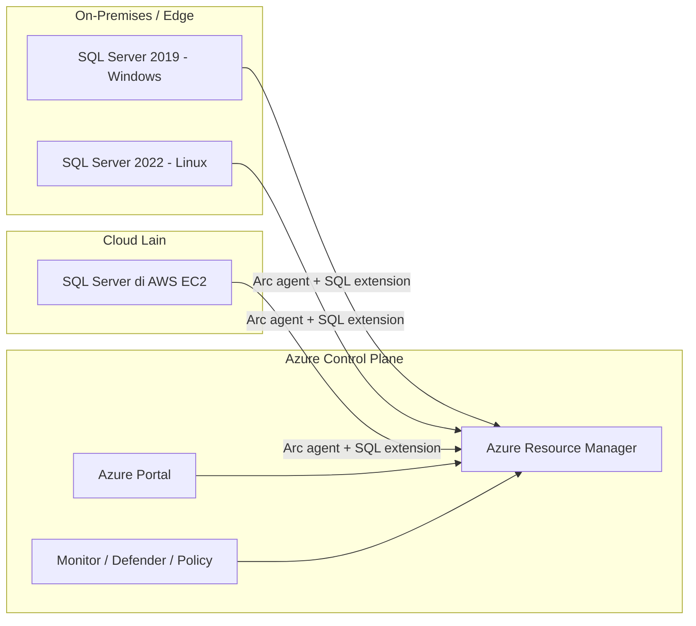
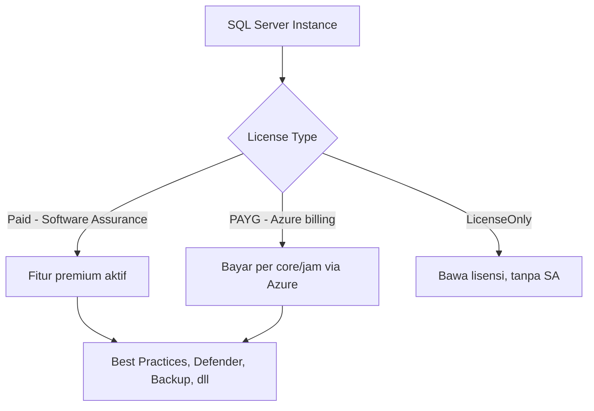

# Modul 01 — Pengenalan Azure Arc & Arc-enabled SQL Server

> 📚 Sumber utama: [SQL Server enabled by Azure Arc — Overview](https://learn.microsoft.com/sql/sql-server/azure-arc/overview) · [Azure Arc overview](https://learn.microsoft.com/azure/azure-arc/overview)

## 1.1 Apa itu Azure Arc?

**Azure Arc** adalah platform manajemen hybrid/multi-cloud dari Microsoft yang memperluas Azure Resource Manager (ARM) ke resource di luar Azure: server fisik, VM di datacenter sendiri, di edge (mis. toko ritel), atau di cloud lain (AWS, GCP).

Setelah resource diregistrasi ke Arc, ia menjadi **resource hybrid Azure** dengan ARM Resource ID, sehingga dapat memanfaatkan layanan Azure: RBAC, Policy, Monitor, Defender, Update Management, dll.

## 1.2 Apa itu SQL Server enabled by Azure Arc?

SQL Server enabled by Azure Arc memperluas layanan Azure ke instance **SQL Server yang berjalan di luar Azure**:

- Di datacenter Anda sendiri
- Di edge (cabang, toko ritel)
- Di public cloud / hosting provider lain
- Di SQL Server VM di Azure VMware Solution

Dengan ini, semua instance SQL Server tampil dan dikelola dari **Azure Portal sebagai single pane of glass**.

## 1.3 Mengapa Enable SQL Server ke Azure Arc?

Manfaat utama menurut dokumentasi Microsoft:

| Kategori | Manfaat |
|----------|---------|
| **Inventory & Visibility** | Lihat semua SQL Server (versi, edisi, core, OS, database) terpusat di Azure Portal & Resource Graph |
| **Best Practices Assessment** | Audit konfigurasi SQL Server berdasarkan praktik Microsoft Support |
| **Microsoft Defender for Cloud** | Vulnerability assessment + advanced threat protection (dengan diskon via Arc) |
| **Microsoft Entra ID Authentication** | Modern auth (MFA, SSO) untuk SQL Server 2022+ |
| **Microsoft Purview** | Data governance, klasifikasi, lineage, access policies |
| **Pay-as-you-go (PAYG)** | Alternatif lisensi: bayar sesuai pemakaian, billed via Azure |
| **Extended Security Updates (ESU)** | Subscribe ESU untuk SQL Server end-of-support, gratis bila instance ke-Arc-kan |
| **Automated Backup & PITR** | Backup native otomatis + Point-in-Time Restore |
| **Migration Assessment** | Otomatis menilai kesiapan migrasi ke Azure SQL MI / Azure VM |
| **Automatic Updates / Patching** | Patch otomatis SQL Server |

## 1.4 Versi & Edisi yang Didukung

- **Versi**: SQL Server **2012 sampai 2025**, di Windows atau Linux
- **Edisi**: Enterprise, Standard, Express, Developer, Evaluation
- Beberapa fitur (mis. Microsoft Entra Auth, Purview policies) hanya untuk **SQL Server 2022+**

## 1.5 Model Konsumsi

> Fitur tertentu (Backup otomatis, Defender, Entra Auth, BPA) **memerlukan lisensi Paid (SA) atau PAYG**.

## 1.6 Ringkasan

- Azure Arc = perluasan ARM ke luar Azure.
- Arc-enabled SQL = SQL Server di mana saja, dikelola dari Azure.
- Membuka pintu ke fitur cloud (Defender, Purview, Entra, Backup, Migrasi).
- Tahap pertama: **menyambungkan** server ke Arc → modul berikutnya.

---

➡️ Lanjut: [Modul 02 — Arsitektur & Komponen](02-arsitektur.md)
