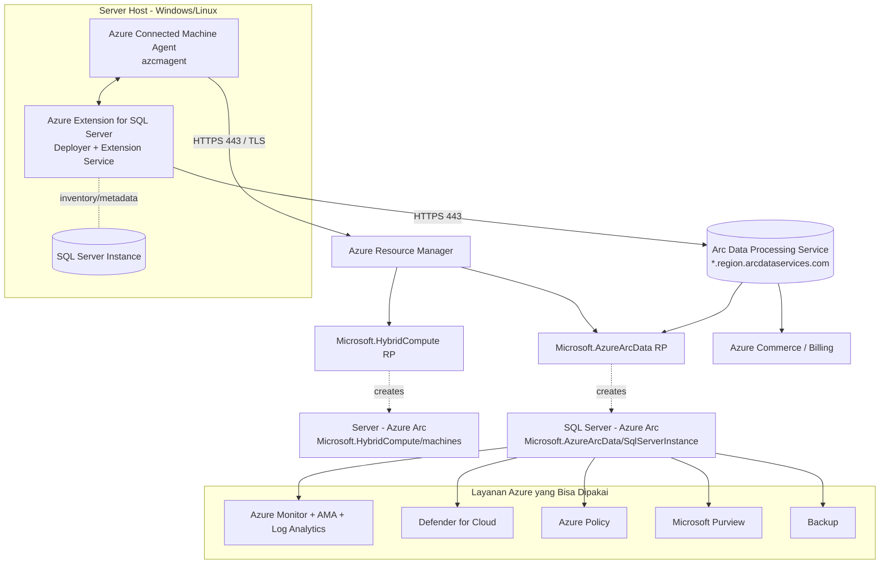
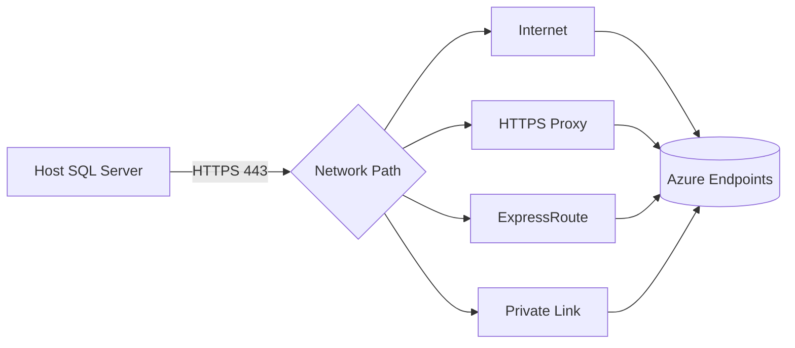

# Modul 02 — Arsitektur & Komponen

> 📚 Sumber utama: [Architecture (Overview)](https://learn.microsoft.com/sql/sql-server/azure-arc/overview#architecture) · [Security overview](https://learn.microsoft.com/sql/sql-server/azure-arc/security-overview) · [Connected Machine agent overview](https://learn.microsoft.com/azure/azure-arc/servers/agent-overview)

## 2.1 Komponen Utama

Ada **dua komponen software** yang harus terpasang di server tujuan agar SQL Server bisa "enabled by Azure Arc":

1. **Azure Connected Machine agent (`azcmagent`)** — menghubungkan server ke Azure (membuat resource `Microsoft.HybridCompute/machines`).
2. **Azure Extension for SQL Server (`WindowsAgent.SqlServer` / `LinuxAgent.SqlServer`)** — mendeteksi instance SQL Server, mengirim inventory & usage, menerima perintah konfigurasi.

Di sisi Azure ada **dua Resource Provider**:

- `Microsoft.HybridCompute` — lifecycle Arc server & ekstensi
- `Microsoft.AzureArcData` — lifecycle resource `SQL Server - Azure Arc` (`SqlServerInstance`)

Dan layanan backend:

- **Azure Arc Data Processing Service (DPS)** — endpoint regional `*.<region>.arcdataservices.com` yang menerima inventory & usage SQL Server, lalu update ARM dan billing.

## 2.2 Diagram Arsitektur

## 2.3 Jalur Komunikasi (Networking)

Semua komunikasi dari host ke Azure adalah **outbound HTTPS (TCP 443) + TLS**. Dapat melalui:

| Jalur | Keterangan |
|-------|-----------|
| Internet langsung | Paling sederhana |
| Internet via HTTPS proxy | Konfigurasi proxy di `azcmagent` |
| Azure ExpressRoute | Private peering |
| Azure Private Link | Private endpoint untuk Arc |

## 2.4 Komponen Internal Ekstensi SQL

Azure Extension for SQL Server terdiri dari:

- **Deployer** — bootstrap install/enable/update/disable/uninstall. Berjalan sebagai **Local System** (via Connected Machine agent).
- **Extension Service** — service background:
  - Windows: *Microsoft SQL Server Extension Service*, default `Local System` (atau `NT Service\SQLServerExtension` jika **least privilege** diaktifkan).
  - Linux: berjalan sebagai `root`.

Tugas Extension Service:

- Mengumpulkan inventory & metadata DB (per jam) → upload ke DPS
- Menjalankan fitur: backup otomatis, BPA, automatic updates, monitoring, dsb.

## 2.5 Resource yang Terbentuk di Azure

Setelah onboarding sukses, di resource group Anda akan muncul:

| Resource Type | Maksud |
|---------------|--------|
| `Microsoft.HybridCompute/machines` | Representasi server fisik/VM |
| `Microsoft.HybridCompute/machines/extensions` | Ekstensi terpasang (SQL, AMA, dll.) |
| `Microsoft.AzureArcData/sqlServerInstances` | Tiap instance SQL Server |
| `Microsoft.AzureArcData/sqlServerInstances/databases` | Tiap database |

> Resource `SQL Server - Azure Arc` selalu berada di **region & resource group yang sama** dengan resource `Server - Azure Arc`-nya.

## 2.6 Ringkasan

- 2 komponen lokal (agent + extension), 2 RP di Azure (`HybridCompute`, `AzureArcData`), 1 backend (DPS).
- Semua komunikasi outbound HTTPS 443.
- Setelah onboarding, instance & database muncul sebagai ARM resource.

---

⬅️ [Modul 01](01-pengenalan.md) · ➡️ [Modul 03 — Prasyarat & Persiapan](03-prasyarat.md)
