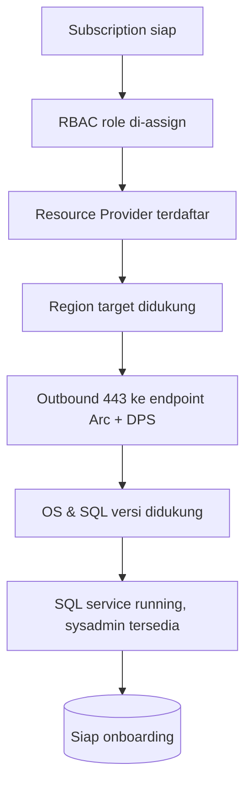

# Modul 03 — Prasyarat & Persiapan

> 📚 Sumber utama: [Prerequisites - SQL Server enabled by Azure Arc](https://learn.microsoft.com/sql/sql-server/azure-arc/prerequisites) · [Connected Machine agent prerequisites](https://learn.microsoft.com/azure/azure-arc/servers/prerequisites) · [Network requirements](https://learn.microsoft.com/azure/azure-arc/servers/network-requirements)

Sebelum onboarding, pastikan **lingkungan Azure** dan **server target** sudah memenuhi syarat berikut.

## 3.1 Subscription & Identity

- **Azure subscription aktif**.
- Akun yang menjalankan onboarding membutuhkan **role minimal**:
  - `Azure Connected Machine Onboarding` (untuk register Arc server), atau
  - `Contributor` pada resource group target.
- Untuk fitur tambahan:
  - `Azure Connected Machine Resource Administrator` — kelola Arc server
  - `Azure Hybrid Database Administrator` — kelola SQL Server – Arc
  - `Log Analytics Contributor` — untuk BPA
  - `User Access Administrator` — bila buat managed identity baru via Policy

## 3.2 Resource Provider

Daftarkan di **setiap subscription**:

```powershell
az provider register --namespace 'Microsoft.HybridCompute'
az provider register --namespace 'Microsoft.GuestConfiguration'
az provider register --namespace 'Microsoft.HybridConnectivity'
az provider register --namespace 'Microsoft.AzureArcData'   # WAJIB untuk SQL
```

## 3.3 Sistem Operasi & SQL Server yang Didukung

| Item | Dukungan |
|------|----------|
| OS | Windows Server 2012 R2+, Ubuntu, RHEL, SLES, dll. (lihat docs Connected Machine agent) |
| SQL Server | 2012, 2014, 2016, 2017, 2019, 2022, 2025 |
| Edisi | Enterprise, Standard, Express, Developer, Evaluation |

> Beberapa fitur (Entra Auth, Purview policies, dsb.) hanya untuk **SQL Server 2022+**.

## 3.4 Region yang Didukung

SQL Server enabled by Azure Arc tersedia di region-region berikut (lihat [daftar resmi](https://learn.microsoft.com/sql/sql-server/azure-arc/overview#supported-azure-regions) untuk update terbaru):

| Wilayah | Region |
|---------|--------|
| Americas | East US, East US 2, West US, West US 2, West US 3, Central US, North Central US, South Central US, West Central US, Canada Central, Canada East, Brazil South, US Gov Virginia¹ |
| Europe | UK South, UK West, France Central, West Europe, North Europe, Switzerland North, Sweden Central, Norway East |
| Asia Pacific | Central India, Japan East, Korea Central, **Southeast Asia**, Australia East |
| Middle East / Africa | UAE North, South Africa North |

¹ US Gov Virginia memiliki keterbatasan fitur — lihat [SQL Server enabled by Azure Arc in US Government](https://learn.microsoft.com/sql/sql-server/azure-arc/us-government-region) (auto-connect tidak tersedia, gunakan jalur manual di modul 04).

> ⚠️ **Penting**: assign **region yang sama** untuk resource Arc-enabled Server dan Arc-enabled SQL Server.

## 3.5 Jaringan / Firewall

Buka outbound HTTPS (TCP 443) ke endpoint berikut. Daftar lengkap & up-to-date: [Connected Machine agent network requirements](https://learn.microsoft.com/azure/azure-arc/servers/network-requirements).

| Endpoint | Tujuan |
|----------|--------|
| `management.azure.com` | ARM API |
| `login.microsoftonline.com` | Microsoft Entra ID auth |
| `*.his.arc.azure.com` / `gbl.his.arc.azure.com` | Hybrid Identity Service |
| `*.guestconfiguration.azure.com` | Guest Configuration / Policy |
| `*.<region>.arcdataservices.com` | **DPS — wajib untuk SQL Server** |
| `*.<region>.arcdataservices.azure.us` | DPS untuk US Gov Virginia |
| `download.microsoft.com` | Download installer |

Untuk segmen `<region>`, buang spasi dari nama region (mis. *East US 2* → `eastus2`).

Jika menggunakan proxy, set saat install:

```powershell
azcmagent config set proxy.url "http://proxy.contoso.local:8080"
# Bypass tertentu (mulai extension v1.1.2986.256)
[Environment]::SetEnvironmentVariable("NO_PROXY", "localhost,127.0.0.1", "Machine")
```

> Catatan: **Azure Private Link tidak didukung** untuk koneksi ke Azure Arc Data Processing Service. Lihat [Connect to Azure Arc data processing service](https://learn.microsoft.com/sql/sql-server/azure-arc/prerequisites#connect-to-azure-arc-data-processing-service).

## 3.6 Permission di SQL Server

Saat extension diinstall otomatis, akun service-nya (default `NT AUTHORITY\SYSTEM` di Windows, `root` di Linux) diberi role/permission yang dibutuhkan SQL (mis. `dbcreator`, `db_backupoperator` untuk backup).

Jika menggunakan **least privilege mode**, akan dibuat akun lokal `NT Service\SQLServerExtension` dengan login SQL khusus dan permission minimal.

## 3.7 Checklist Persiapan



Cek cepat di server (PowerShell):

```powershell
# Konektivitas
Test-NetConnection management.azure.com -Port 443
Test-NetConnection eastus.arcdataservices.com -Port 443  # ganti region

# SQL Server running
Get-Service | Where-Object { $_.Name -like 'MSSQL*' }
```

---

⬅️ [Modul 02](02-arsitektur.md) · ➡️ [Modul 04 — Enable / Onboarding](04-onboarding.md)
