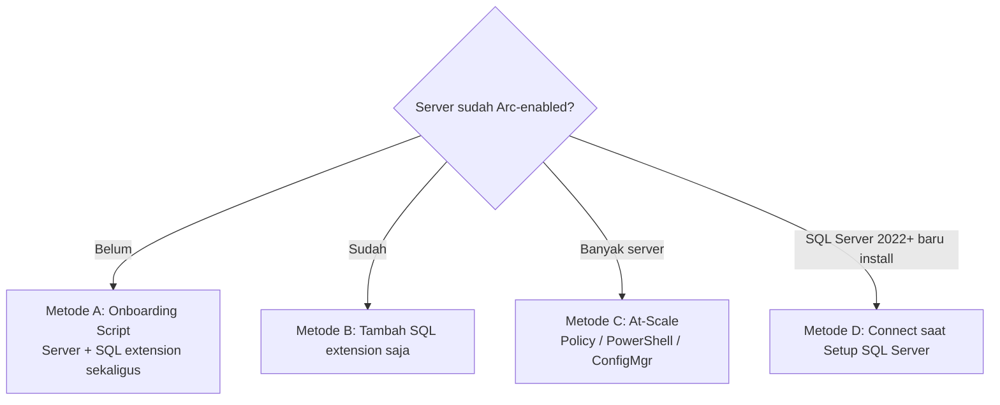
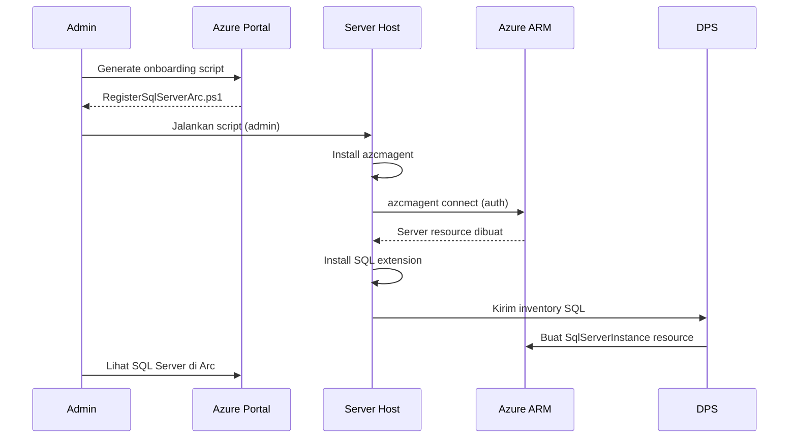

# Modul 04 — Enable / Onboarding SQL Server ke Azure Arc

> 📚 Sumber utama:
> - [Deployment options for SQL Server enabled by Azure Arc](https://learn.microsoft.com/sql/sql-server/azure-arc/deployment-options)
> - [Connect your SQL Server to Azure Arc](https://learn.microsoft.com/sql/sql-server/azure-arc/connect)
> - [Connect SQL Server on a server already enabled by Arc](https://learn.microsoft.com/sql/sql-server/azure-arc/connect-already-enabled)
> - [Manage automatic connection (auto-onboarding)](https://learn.microsoft.com/sql/sql-server/azure-arc/manage-autodeploy)
> - [Connect machines at scale with Configuration Manager](https://learn.microsoft.com/azure/azure-arc/servers/onboard-configuration-manager-powershell)

Ada beberapa **metode onboarding**. Pilih sesuai kondisi server Anda.

## 4.1 Memilih Metode



| Metode | Skenario |
|--------|----------|
| **A. Onboarding script** | Server belum di-Arc, ingin langsung sekalian SQL extension |
| **B. Add extension** | Server sudah Arc, tinggal install Azure Extension for SQL Server |
| **C. At-scale (Policy)** | Banyak server, otomatisasi |
| **D. Saat install SQL 2022+** | Wizard installer punya tab Azure |

> Catatan: Jika server sudah Arc-enabled dan SQL terdeteksi, **secara default extension SQL diinstall otomatis** (auto-onboarding) di region yang didukung. Anda bisa **opt-out** dengan tag `ArcSQLServerExtensionDeployment = Disabled`.

---

## 4.2 Metode A — Onboarding Script (server belum Arc-enabled)

### Langkah di Azure Portal

1. Buka **Azure Arc Center → Data services → SQL servers → + Add**.
2. Pilih **Connect SQL Server instances**.
3. Isi **Subscription, Resource Group, Region, OS**, optional Server Name & proxy.
4. Pilih **SQL Server edition & license type** (Paid/PAYG/LicenseOnly).
5. Kecualikan instance bila perlu (pisah dengan spasi).
6. *Tags* (opsional) → **Run script** → **Download** `RegisterSqlServerArc.ps1` (Windows) atau `.sh` (Linux).

### Eksekusi di Server

**Windows (PowerShell admin):**

```powershell
# Login ke Azure (jika belum)
Connect-AzAccount

# Jalankan script onboarding
& '.\RegisterSqlServerArc.ps1'
```

**Linux:**

```bash
# Login Azure CLI
az login

chmod +x ./RegisterSqlServerArc.sh
sudo ./RegisterSqlServerArc.sh
```

Script akan:

1. Install Azure Connected Machine agent (`azcmagent`)
2. Register server → resource `Server - Azure Arc`
3. Install Azure Extension for SQL Server
4. Buat resource `SQL Server - Azure Arc` per instance

### Diagram Alur



---

## 4.3 Metode B — Server Sudah Arc-enabled, Tambah Extension

### Via Azure Portal

1. Buka **Azure Arc → Servers** → pilih server.
2. **Extensions → + Add → Azure extension for SQL Server**.
3. Pilih edition & license type, isi instance yang dikecualikan → **Review + Create**.

### Via PowerShell

```powershell
$ResourceGroup = "rg-arc-sql"
$MachineName   = "SRV-SQL01"
$Location      = "southeastasia"
$LicenseType   = "Paid"   # Paid | PAYG | LicenseOnly

New-AzConnectedMachineExtension `
  -ResourceGroupName $ResourceGroup `
  -MachineName $MachineName `
  -Name "WindowsAgent.SqlServer" `
  -Publisher "Microsoft.AzureData" `
  -ExtensionType "WindowsAgent.SqlServer" `
  -Location $Location `
  -Setting @{
      "LicenseType"   = $LicenseType
      "SqlManagement" = @{ "IsEnabled" = $true }
  }
```

### Via Azure CLI

```azurecli
az connectedmachine extension create \
  --resource-group rg-arc-sql \
  --machine-name SRV-SQL01 \
  --name WindowsAgent.SqlServer \
  --publisher Microsoft.AzureData \
  --type WindowsAgent.SqlServer \
  --location southeastasia \
  --settings '{"LicenseType":"Paid","SqlManagement":{"IsEnabled":true}}'
```

> Untuk Linux, ganti `WindowsAgent.SqlServer` dengan `LinuxAgent.SqlServer`. Azure extension for SQL Server di Linux tersedia dalam **preview**.

---

## 4.4 Metode C — At Scale (Azure Policy)

Gunakan policy bawaan: **"Configure SQL Server enabled by Azure Arc to install Azure extension for SQL Server"**.


Langkah:

1. **Policy → Definitions** → cari "Arc-enabled SQL".
2. **Assign** ke subscription/RG, isi parameter (license type, dsb.).
3. Policy akan **remediasi** server yang belum punya extension.

Untuk **banyak server baru**, gabungkan dengan onboarding via:

- Configuration Manager (PowerShell / custom task sequence)
- Group Policy
- Service principal + script

## 4.5 Metode D — Connect Saat Install SQL Server 2022+

Pada SQL Server 2022/2025 setup wizard di Windows, ada langkah **Azure Extension for SQL Server**. Centang dan isi service principal/credentials → server otomatis terhubung ke Arc setelah install.

## 4.6 Opt-out Auto-onboarding

Bila tidak ingin SQL extension dipasang otomatis, beri tag pada **subscription / RG / server**:

| Tag | Value |
|-----|-------|
| `ArcSQLServerExtensionDeployment` | `Disabled` |

> Perubahan tag bisa butuh hingga 8 jam untuk berlaku karena cache.

## 4.7 Verifikasi Onboarding

```powershell
# Lihat semua Arc server
az connectedmachine list -o table

# Lihat semua SQL Server – Arc
az resource list --resource-type "Microsoft.AzureArcData/sqlServerInstances" -o table
```

Resource Graph query untuk inventaris:

```kusto
resources
| where type =~ 'microsoft.azurearcdata/sqlserverinstances'
| project name, resourceGroup, location, properties.version, properties.edition, properties.hostType
```

---

⬅️ [Modul 03](03-prasyarat.md) · ➡️ [Modul 05 — Konfigurasi & Lisensi](05-konfigurasi-lisensi.md)
