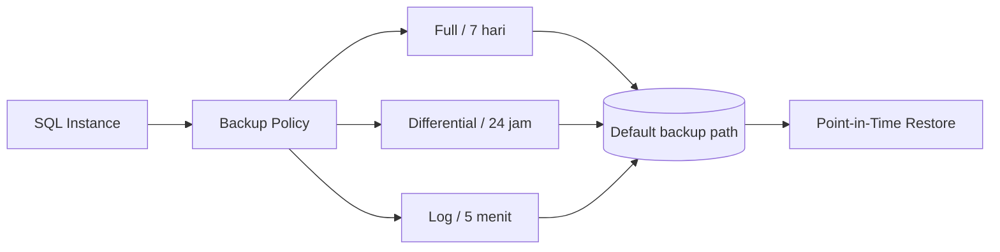
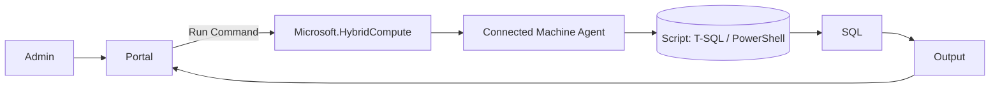
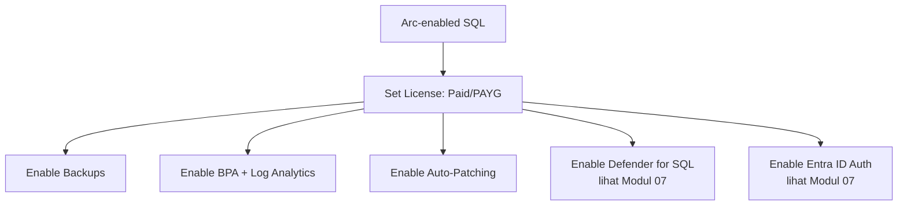

# Modul 06 — Fitur Manajemen

> 📚 Sumber utama:
> - [Best Practices Assessment](https://learn.microsoft.com/sql/sql-server/azure-arc/assess)
> - [Automated backups (preview)](https://learn.microsoft.com/sql/sql-server/azure-arc/backup-local)
> - [Point-in-time restore](https://learn.microsoft.com/sql/sql-server/azure-arc/point-in-time-restore)
> - [Automatic updates](https://learn.microsoft.com/sql/sql-server/azure-arc/update)
> - [Performance monitoring (preview)](https://learn.microsoft.com/sql/sql-server/azure-arc/sql-monitoring)
> - [Client connection summary](https://learn.microsoft.com/sql/sql-server/azure-arc/sql-connection-summary)
> - [View inventory](https://learn.microsoft.com/sql/sql-server/azure-arc/view-inventory)

Setelah konfigurasi lisensi, aktifkan fitur Day-2 yang membuat Arc-enabled SQL bermanfaat secara operasional.

## 6.1 Inventory & Resource Graph

Setiap instance & database muncul sebagai ARM resource. Contoh query Resource Graph:

```kusto
// Semua SQL Server 2014
resources
| where type =~ 'microsoft.azurearcdata/sqlserverinstances'
| where properties.version == 'SQL Server 2014'
| project name, resourceGroup, properties.edition, properties.hostType

// Database belum di-backup > 7 hari
resources
| where type =~ 'microsoft.azurearcdata/sqlserverinstances/databases'
| extend lastBackup = todatetime(properties.backupInformation.lastFullBackup)
| where lastBackup < ago(7d)
| project name, lastBackup
```

Anda bisa pin chart hasil query ini ke **Azure Dashboard** (lihat sample dashboard `microsoft/sql-server-samples` di GitHub).

## 6.2 Best Practices Assessment (BPA)

Audit konfigurasi SQL Server berdasarkan rekomendasi Microsoft Support.

**Persyaratan:**

- SQL Server di **Windows** (belum tersedia untuk Linux)
- Versi extension `WindowsAgent.SqlServer` ≥ `1.1.2202.47` (single instance) / `1.1.2231.59` (multi-instance)
- Untuk named instance: SQL Server Browser harus running
- **Log Analytics workspace** di subscription yang sama
- Role: `Log Analytics Contributor` + `Azure Connected Machine Resource Administrator`

**Aktifkan:**

1. Portal → SQL Server – Arc → **Best practices assessment → Enable**.
2. Pilih Log Analytics workspace.
3. Atur jadwal (mis. mingguan).
4. Lihat hasil di **Insights** → daftar rekomendasi + cara perbaikan.

**At-scale via Azure Policy**: *Configure Arc-enabled Servers with SQL Server extension installed to enable or disable SQL best practices assessment*.

## 6.3 Automated Backups (Local) + Point-in-Time Restore

Backup native SQL ke folder default backup (lokal atau network share), otomatis dijadwalkan oleh extension. Status: **Preview**.

### Default schedule (jika pilih *default-policy*)

| Item | Default |
|------|---------|
| Retention | **7 hari** |
| Full backup | tiap **7 hari** |
| Differential | tiap **24 jam** |
| Transaction log | tiap **5 menit** |

### Range yang diperbolehkan

- **Retention**: `1`–`35` hari (`0` = disable)
- Full: harian atau mingguan
- Differential: setiap **12 atau 24 jam**
- Transaction log: kelipatan **5 menit**



### Aktifkan via Portal

1. Portal → SQL Server – Arc → **Backups → Configure policies**.
2. Set **retention days** (1–35) + jadwal Full/Diff/TLog.
3. Bisa di-set **per instance** atau **per database** (override).

### Aktifkan via Azure CLI

```azurecli
# Tambahkan extension arcdata jika belum
az extension add --name arcdata

# Default policy di level instance
az sql server-arc backups-policy set \
  --name MyArcServer_SQLServerPROD \
  --resource-group MyResourceGroup \
  --default-policy

# Custom policy
az sql server-arc backups-policy set \
  --name MyArcServer_SQLServerPROD \
  --resource-group MyResourceGroup \
  --retention-days 24 --full-backup-days 7 \
  --diff-backup-hours 24 --tlog-backup-mins 30

# Lihat policy aktif
az sql server-arc backups-policy show \
  --name MyArcServer_SQLServerPROD --resource-group MyResourceGroup
```

Untuk policy **per database**, gunakan `az sql db-arc backups-policy set --name <db> --server <arc-server-name> ...`.

### Service account untuk backup

- Default: `NT AUTHORITY\SYSTEM`. Sejak extension `1.1.2504.99`, permission diberikan otomatis.
- Least privilege: `NT Service\SQLServerExtension`.
- Untuk versi lama, manual assign `dbcreator` (server) + `db_backupoperator` (master/model/msdb + tiap user DB).

### Restore / PITR

Azure Portal → pilih database → **Restore** → pilih restore point → buat database baru. Lihat [Point-in-time restore](https://learn.microsoft.com/sql/sql-server/azure-arc/point-in-time-restore).

> Saat ini fitur backup & PITR masih **preview** (tunduk pada [Supplemental Terms of Use](https://azure.microsoft.com/support/legal/preview-supplemental-terms/)). Backup ditulis ke **default backup location** (lokal/network share), bukan langsung ke Azure Storage.

## 6.4 Automatic Updates / Patching

Auto-patching SQL Server (CU/security update).

- Aktifkan: **Updates → Configure** → set jadwal maintenance window.
- Diintegrasikan dengan **Azure Update Manager**.
- Tersedia untuk SQL 2012+ (2012 perlu ESU aktif).

## 6.5 Monitoring (Preview)

Collect performance metrics SQL Server ke Azure Monitor.

- **Default Enabled** sejak ekstensi versi terbaru.
- Lihat di portal: SQL Server – Arc → **Monitoring** (CPU, memory, IO, wait stats, dll.).
- Untuk dashboard custom & alerting, hubungkan ke **Log Analytics** + **Workbooks**.

## 6.6 Run Command (Eksekusi T-SQL At-Scale)

Gunakan **Azure Arc-enabled servers Run Command** untuk menjalankan script T-SQL/PowerShell di banyak server sekaligus.



> **Hati-hati**: Run Command berjalan sebagai **Local System / root**. Terapkan least privilege di dalam script (mis. login SQL khusus dengan permission minimum).

## 6.7 Migration Assessment (default Enabled)

Otomatis mengevaluasi readiness SQL Server untuk migrasi ke Azure SQL. Lihat detail di **Modul 08**.

## 6.8 Client Connection Summary

Lihat siapa/aplikasi apa yang konek ke SQL via portal (perlu extension `≥ 1.1.2986.256`, license Paid/PAYG, SQL ≥ 2016 SP1, OS Windows ≥ 2016).

## 6.9 Ringkasan Aktivasi Fitur



---

⬅️ [Modul 05](05-konfigurasi-lisensi.md) · ➡️ [Modul 07 — Keamanan](07-keamanan.md)
