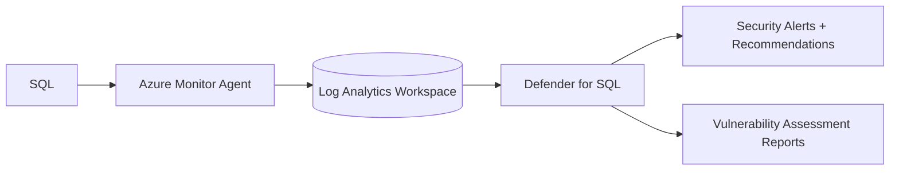
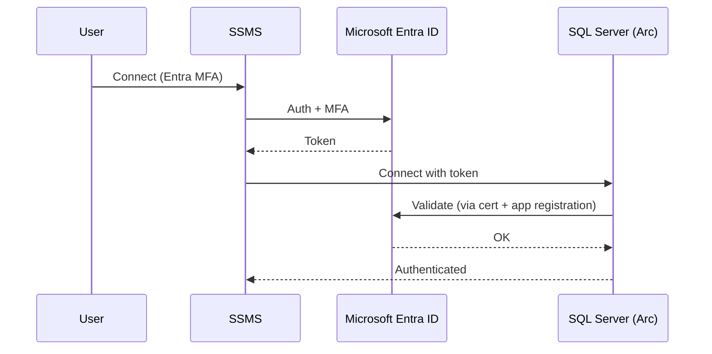
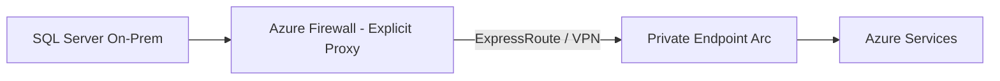
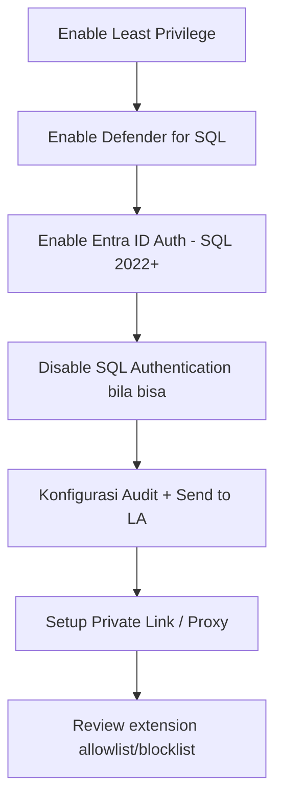

# Modul 07 — Keamanan

> 📚 Sumber utama:
> - [Security overview](https://learn.microsoft.com/sql/sql-server/azure-arc/security-overview)
> - [Defender for SQL on machines](https://learn.microsoft.com/azure/defender-for-cloud/defender-for-sql-usage)
> - [Microsoft Entra authentication for SQL Server](https://learn.microsoft.com/sql/relational-databases/security/authentication-access/azure-ad-authentication-sql-server-overview)
> - [Microsoft Entra setup tutorial](https://learn.microsoft.com/sql/relational-databases/security/authentication-access/azure-ad-authentication-sql-server-setup-tutorial)
> - [Microsoft Purview: register & scan Arc-enabled SQL](https://learn.microsoft.com/purview/register-scan-azure-arc-enabled-sql-server)
> - [Configure least privilege](https://learn.microsoft.com/sql/sql-server/azure-arc/configure-least-privilege)
> - [Configure private path](https://learn.microsoft.com/sql/sql-server/azure-arc/configure-private-path)
> - [Permissions granted by extension](https://learn.microsoft.com/sql/sql-server/azure-arc/permissions-granted-agent-extension)

Arc-enabled SQL membuka berbagai layanan keamanan Azure untuk SQL Server di luar Azure.

## 7.1 Microsoft Defender for Cloud (Defender for SQL)

Memberikan:

- **Vulnerability assessment** — scan konfigurasi & schema, beri rekomendasi remediasi.
- **Advanced Threat Protection** — alert untuk SQL injection, anomalous access, brute force, dsb.

**Aktivasi:**

1. Defender for Cloud → **Environment settings → Subscription/Workspace → Defender plans → SQL servers on machines: On**.
2. Pastikan **Azure Monitor Agent (AMA)** ter-install di Arc server (Defender bisa auto-deploy).
3. Verifikasi alert/rekomendasi muncul setelah ~24 jam.

> Bila diaktifkan **lewat SQL Server enabled by Azure Arc**, Anda mendapatkan **diskon harga Defender** signifikan dibanding aktivasi langsung.

## 7.2 Microsoft Entra ID Authentication

Mengganti SQL Authentication (username/password) dengan auth modern (MFA, SSO, managed identity).

**Persyaratan:**

- SQL Server **2022 atau lebih baru**
- SQL Server enabled by Azure Arc
- Certificate untuk SQL → Azure (bisa auto-generate)
- App Registration di Microsoft Entra ID

**Setup ringkas (portal):**

1. Buka SQL Server – Arc → **Microsoft Entra ID**.
2. Buat / pilih **App registration** + **Certificate** + **Key Vault** (atau gunakan otomatis).
3. Set **Microsoft Entra admin** untuk SQL.
4. Save → tunggu sukses.
5. Buat login Entra di SQL: `CREATE LOGIN [user@contoso.com] FROM EXTERNAL PROVIDER;`

## 7.3 Microsoft Purview

Governance & klasifikasi data:

- **Scan** SQL Server – Arc untuk inventory schema + sensitive data classification.
- **DevOps Policies** & **Data Owner Policies** untuk grant akses (SQL Server 2022).

Prasyarat akses policy:

- SQL Server 2022 di Windows/Linux
- Onboarding SQL ke Arc selesai
- Microsoft Entra Auth aktif di SQL
- App registration terpisah per instance (best practice)
- Konfigurasi Microsoft Purview account & register data source

## 7.4 Least Privilege Mode

Lihat juga **Modul 05 §5.5**. Kunci: extension berjalan sebagai service account terbatas, bukan Local System.

| Aspek | Default | Least Privilege |
|-------|---------|-----------------|
| Service account | Local System | `NT Service\SQLServerExtension` |
| SQL login | `NT AUTHORITY\SYSTEM` (sysadmin) | Login khusus, permission per fitur |
| Risk | Tinggi | Rendah |

## 7.5 Audit & Activity Log

- **Activity Log** di SQL Server – Arc resource: melacak operasi ARM (siapa enable apa, kapan).
- **SQL Audit** native: tetap berjalan di SQL.
- Run Command activity: tercatat di Azure Activity Log.

## 7.6 Network Security

- Komunikasi outbound HTTPS 443 + TLS — tidak ada inbound port.
- Gunakan **Azure Private Link for Arc** untuk private path.
- Jika perlu site-to-site VPN + Azure Firewall sebagai forward proxy, lihat docs *Configure private path*.

## 7.7 Permission yang Diberikan ke SQL

Saat extension diinstall, beberapa role/permission diberikan otomatis ke service account, antara lain:

- `dbcreator` (untuk backup/migration)
- `db_backupoperator` di system & user DB
- `VIEW SERVER STATE`, `VIEW ANY DEFINITION` (untuk inventory)

Lihat docs lengkap: *Permissions granted to the agent and extension*.

## 7.8 Checklist Hardening

---

⬅️ [Modul 06](06-fitur-manajemen.md) · ➡️ [Modul 08 — Migrasi ke Azure SQL](08-migrasi.md)
