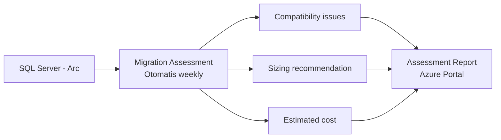
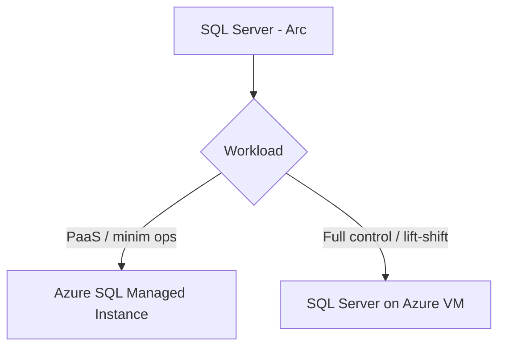
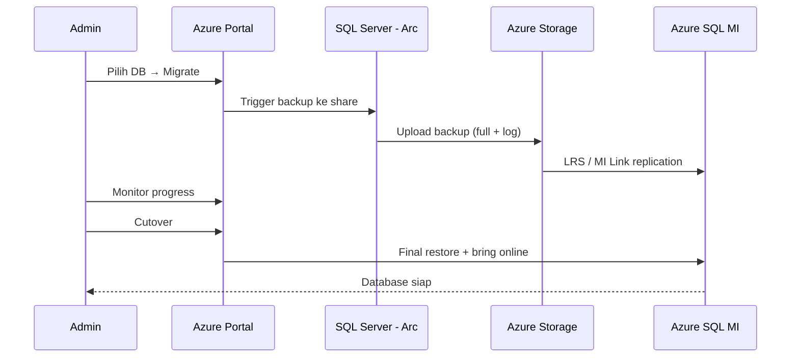

# Modul 08 — Migrasi ke Azure SQL

> 📚 Sumber utama:
> - [Migration overview](https://learn.microsoft.com/sql/sql-server/azure-arc/migration-overview)
> - [Migration assessment](https://learn.microsoft.com/sql/sql-server/azure-arc/migration-assessment)
> - [Migrate to Azure SQL Managed Instance](https://learn.microsoft.com/sql/sql-server/azure-arc/migrate-to-azure-sql-managed-instance)
> - [Migrate to SQL Server on Azure VMs](https://learn.microsoft.com/sql/sql-server/azure-arc/migrate-to-sql-server-on-azure-vms)
> - [Azure SQL migration guides](https://learn.microsoft.com/azure/azure-sql/migration-guides/)

Salah satu nilai terbesar Arc-enabled SQL: **otomatisasi assessment & migrasi** ke Azure SQL.

## 8.1 Migration Assessment (Otomatis)

- **Default ENABLED** untuk SQL Server 2012+
- Berjalan otomatis tiap akhir pekan (bisa juga on-demand)
- **Gratis**, untuk semua edition

Yang dilakukan assessment:

1. Discover semua instance + database
2. Identifikasi **compatibility issues** terhadap target Azure SQL
3. Rekomendasikan **service tier & sizing** optimal
4. Hitung **estimasi harga retail**
5. Sarankan target Azure SQL terbaik

Lihat di portal: SQL Server – Arc → **Migration → Assessment**.

## 8.2 Pilihan Target Migrasi

| Target | Karakteristik |
|--------|---------------|
| **Azure SQL Managed Instance (MI)** | PaaS, ~100% kompatibel SQL Server, minim refactor, fitur instance-level (SQL Agent, cross-DB query) |
| **SQL Server on Azure VM** | IaaS, full control, ideal lift-and-shift dengan dependency OS-level |

## 8.3 Metode Migrasi (LRS & MI Link)

| Versi sumber | Metode tersedia |
|--------------|-----------------|
| SQL 2012, 2014 | **Log Replay Service (LRS)** saja |
| SQL 2016, 2017, 2019, 2022, 2025 | **LRS** dan **Managed Instance Link** |

- **LRS** — restore backup full + apply log secara berkala sampai cutover.
- **MI Link** — replikasi near-realtime via Always On (DR / online migration).

## 8.4 Alur End-to-End Migrasi via Portal

1. Buka SQL Server – Arc → **Migration → Assessment** → review & pilih database.
2. Klik **Migrate** → pilih target (SQL MI / Azure VM).
3. Isi koneksi target (subscription, resource group, MI name, dll.).
4. Pilih **mode**: Online (MI Link) / Offline (LRS).
5. Sediakan **storage account + share** untuk backup (LRS).
6. Jalankan migrasi → monitor progress di portal.
7. **Cutover** ketika siap.

## 8.5 Tips Migrasi

- Jalankan **Best Practices Assessment** dulu (Modul 06) — perbaiki sebelum migrasi.
- Pastikan **license type Paid/PAYG** agar fitur migrasi penuh aktif.
- Untuk DB besar, gunakan **MI Link** agar downtime minimal.
- Setelah migrasi sukses, **ESU subscription otomatis berhenti** namun ESU masih bisa diakses bila perlu.
- Update aplikasi → connection string ke MI / VM baru.

## 8.6 Setelah Migrasi

- Validasi data & performance di target.
- Pertahankan SQL Server lama sebagai fallback (read-only) untuk beberapa hari.
- Bersihkan resource lama: lepas extension SQL, decommission server.
- Update inventory & dashboard.

---

⬅️ [Modul 07](07-keamanan.md) · ➡️ [Modul 09 — Troubleshooting](09-troubleshooting.md)
