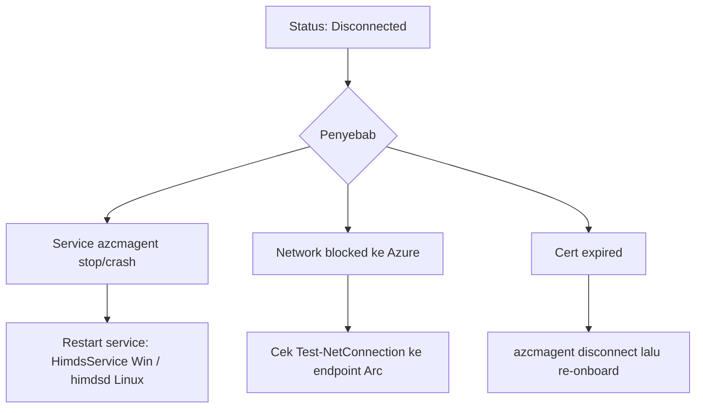
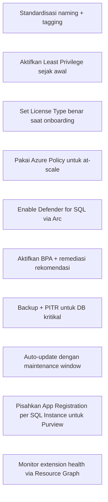

# Modul 09 — Troubleshooting & Best Practices

> 📚 Sumber utama:
> - [Troubleshoot Azure extension for SQL Server](https://learn.microsoft.com/sql/sql-server/azure-arc/troubleshoot-extension)
> - [Troubleshoot deployment](https://learn.microsoft.com/sql/sql-server/azure-arc/troubleshoot-deployment)
> - [Troubleshoot Connected Machine agent](https://learn.microsoft.com/azure/azure-arc/servers/troubleshoot-agent-onboard)
> - [Manage VM extensions](https://learn.microsoft.com/azure/azure-arc/servers/manage-vm-extensions-portal)
> - [FAQ](https://learn.microsoft.com/sql/sql-server/azure-arc/faq)

## 9.1 Status Resource yang Sehat

Resource yang baik:

- **Server – Azure Arc**: `Status = Connected`
- **Extension `WindowsAgent.SqlServer` / `LinuxAgent.SqlServer`**: `Provisioning state = Succeeded`, status `Healthy`
- **SQL Server – Azure Arc**: properti `version`, `edition`, `licenseType` terisi

## 9.2 Masalah Umum & Solusi

### A. Server status = Disconnected



- Restart service:
  - Windows: `Restart-Service Himds`
  - Linux: `sudo systemctl restart himdsd`
- Cek log: `azcmagent logs` (akan zip log untuk troubleshooting)
- Verbose log: `azcmagent connect --verbose`

### B. Extension Unhealthy / Failed

| Pesan | Tindakan |
|-------|----------|
| "Machine cert is expired" | Re-onboard server (uninstall agent → onboarding script lagi). Extension SQL akan auto-install lagi bila auto-onboard aktif. |
| "Machine is disconnected" | Lihat A di atas |
| "Extension installation timed out" | Cek free disk space, restart `ExtensionService`, baca log di `C:\ProgramData\GuestConfig\extension_logs\` |
| "License type missing" | Update setting extension → set `LicenseType` |

### C. SQL Server – Arc resource tidak muncul

1. Pastikan `Microsoft.AzureArcData` resource provider terdaftar.
2. Cek **server tag** `ArcSQLServerExtensionDeployment` — apakah `Disabled`?
3. Cek extension SQL ter-install dan healthy.
4. Cek konektivitas ke `*.<region>.arcdataservices.com`.
5. Tunggu hingga ~30 menit untuk first sync.

### D. Best Practices Assessment tidak jalan

- Workspace Log Analytics di subscription yang sama?
- AMA terinstall?
- Versi extension memenuhi minimum?
- Permission cukup (Log Analytics Contributor)?
- Untuk named instance: SQL Browser running?

### E. Backup gagal

- License = Paid/PAYG?
- Service account punya `dbcreator` + `db_backupoperator`?
- Default backup path writable?
- Disk free space cukup?

### F. PAYG billing tidak muncul

- License type benar `PAYG`?
- Konektivitas DPS OK?
- Tunggu 24 jam (billing batch).

## 9.3 Lokasi Log Penting

| Komponen | Lokasi (Windows) | Lokasi (Linux) |
|----------|------------------|----------------|
| Connected Machine agent | `%ProgramData%\AzureConnectedMachineAgent\Log\` | `/var/opt/azcmagent/log/` |
| Extension SQL | `C:\ProgramData\GuestConfig\extension_logs\Microsoft.AzureData.WindowsAgent.SqlServer\` | `/var/lib/GuestConfig/extension_logs/Microsoft.AzureData.LinuxAgent.SqlServer/` |
| Deployer log | sub-folder `deployer` di atas | sama |
| Extension Service | sub-folder `extension` | sama |

Kumpulkan semua log:

```powershell
azcmagent logs --output C:\Temp\arclogs
```

## 9.4 Diagnostic Queries (Resource Graph)

```kusto
// Server Arc disconnected
resources
| where type =~ 'microsoft.hybridcompute/machines'
| where properties.status != 'Connected'
| project name, resourceGroup, status = properties.status, lastStatus = properties.lastStatusChange

// SQL extension failed
resources
| where type =~ 'microsoft.hybridcompute/machines/extensions'
| where name endswith 'SqlServer'
| where properties.provisioningState != 'Succeeded'
| project machine = tostring(split(id,'/')[8]), state = properties.provisioningState
```

## 9.5 Best Practices



### Operasional

- **Patch Connected Machine agent** rutin (auto-upgrade default).
- **Test private link / proxy** sebelum produksi.
- **Backup** strategy: instance-level + override per DB kritikal.
- **Tag** semua Arc resource untuk cost & ownership.

### Keamanan

- Wajibkan **Microsoft Entra Auth** di SQL 2022+.
- Disable SQL Authentication bila bisa.
- Audit Run Command usage (Activity Log).
- Gunakan extension allowlist untuk membatasi extension yang boleh terpasang.

### Cost

- PAYG cocok untuk workload variable; Paid/SA untuk steady.
- ESU gratis via Arc → manfaatkan untuk SQL legacy yang belum bisa upgrade.
- Defender for SQL via Arc → diskon vs aktivasi langsung.

---

⬅️ [Modul 08](08-migrasi.md) · ➡️ [Modul 10 — Lab End-to-End](10-lab-end-to-end.md)
