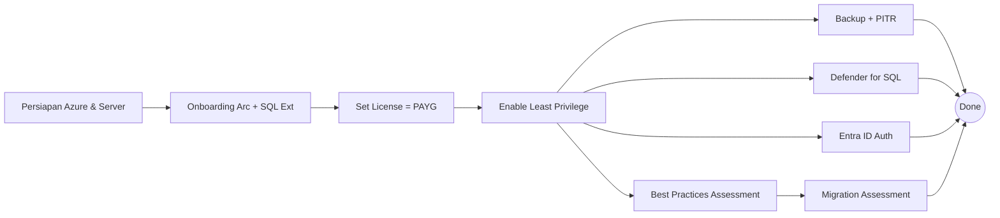
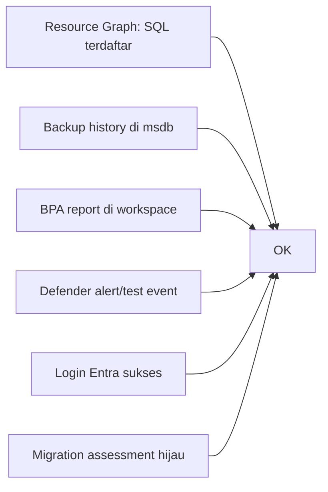

# Modul 10 — Lab End-to-End

> 📚 Referensi praktik tambahan: [Azure Arc Jumpstart — ArcBox for IT Pros](https://azurearcjumpstart.com/azure_jumpstart_arcbox/ITPro) · [Quickstart: Connect hybrid VM with Arc](https://learn.microsoft.com/azure/azure-arc/servers/learn/quick-enable-hybrid-vm)

> ⚠️ **Disclaimer lab**: Skrip & langkah di bawah adalah **contoh untuk environment non-produksi**. Beberapa fitur (Backup, PITR, Monitoring) berstatus *preview*. Aktifkan di sandbox/dev subscription terlebih dulu.

Skenario praktik mengintegrasikan semua modul. Asumsi: Anda punya 1 VM Windows Server (on-premises atau di lab Hyper-V/VMware) dengan **SQL Server 2022 Developer** terinstall.

## 10.1 Skenario

> "Sebagai DBA, saya ingin onboard server `LAB-SQL01` (SQL Server 2022) ke Azure Arc, mengaktifkan backup otomatis, BPA, Defender for SQL, Microsoft Entra Auth, dan menjalankan migration assessment ke Azure SQL MI."



## 10.2 Persiapan

### Variabel

```powershell
$Sub        = "<subscription-id>"
$Rg         = "rg-arc-lab"
$Loc        = "southeastasia"
$Machine    = "LAB-SQL01"
$Workspace  = "law-arc-lab"
```

### Login & RG

```powershell
Connect-AzAccount
Select-AzSubscription -SubscriptionId $Sub
New-AzResourceGroup -Name $Rg -Location $Loc
```

### Register Resource Provider

```powershell
'Microsoft.HybridCompute','Microsoft.GuestConfiguration',
'Microsoft.HybridConnectivity','Microsoft.AzureArcData' |
  ForEach-Object { Register-AzResourceProvider -ProviderNamespace $_ }
```

### Buat Log Analytics workspace

```powershell
New-AzOperationalInsightsWorkspace -ResourceGroupName $Rg `
  -Name $Workspace -Location $Loc -Sku PerGB2018
```

## 10.3 Onboarding (Metode A)

1. Portal → **Azure Arc → SQL servers → + Add → Connect SQL Server instances**.
2. Isi: subscription, RG `rg-arc-lab`, region `Southeast Asia`, OS Windows.
3. License type: **PAYG**, edition: **Developer**.
4. Generate & download `RegisterSqlServerArc.ps1`.

Di server `LAB-SQL01` (PowerShell admin):

```powershell
Connect-AzAccount -UseDeviceAuthentication
& '.\RegisterSqlServerArc.ps1'
```

Verifikasi:

```powershell
Get-AzConnectedMachine -ResourceGroupName $Rg
Get-AzResource -ResourceType "Microsoft.AzureArcData/sqlServerInstances" -ResourceGroupName $Rg
```

## 10.4 Aktifkan Least Privilege

Portal → SQL Server – Arc → **Configuration → Least privilege → Enable**.

Atau via Azure CLI (set license type PAYG sambil pertahankan SQL management):

```azurecli
az connectedmachine extension update \
  --machine-name LAB-SQL01 --resource-group rg-arc-lab \
  --name WindowsAgent.SqlServer --type WindowsAgent.SqlServer \
  --publisher Microsoft.AzureData \
  --settings '{"LicenseType":"PAYG","SqlManagement":{"IsEnabled":true}}'
```

> Untuk mengaktifkan **least privilege** ikuti [docs Configure Least Privilege](https://learn.microsoft.com/sql/sql-server/azure-arc/configure-least-privilege) (lewat Portal atau perintah resmi). Hindari mengirim setting key yang tidak terdokumentasi.

## 10.5 Aktifkan Backup + PITR

Portal → SQL Server – Arc → **Backups → Configure policies**:

- Retention: 7 hari (range 1–35)
- Full: 7 hari, Differential: **24 jam** (atau 12 jam), Log: 5 menit
- Apply ke instance `MSSQLSERVER`

Atau via CLI:

```azurecli
az extension add --name arcdata
az sql server-arc backups-policy set \
  --name LAB-SQL01_MSSQLSERVER --resource-group rg-arc-lab \
  --default-policy
```

Test restore: pilih DB → **Restore** → pilih restore point → buat DB baru `AdventureWorks_Restored`.

## 10.6 Aktifkan Best Practices Assessment

Portal → SQL Server – Arc → **Best practices assessment → Enable**:

- Pilih workspace `law-arc-lab`
- Schedule: weekly (Sunday 02:00)

Tunggu run pertama → review rekomendasi.

## 10.7 Aktifkan Defender for SQL

1. **Defender for Cloud → Environment settings → subscription** → Defender plans.
2. **SQL servers on machines: On**.
3. Konfigurasi auto-deploy AMA & workspace = `law-arc-lab`.
4. Tunggu ~24 jam → cek **Recommendations** & **Security alerts** untuk SQL.

## 10.8 Aktifkan Microsoft Entra ID Authentication

Portal → SQL Server – Arc → **Microsoft Entra ID**:

1. Buat App registration (atau pilih existing).
2. Generate certificate (auto) → simpan ke Key Vault.
3. Set **Microsoft Entra admin** = `dba-team@contoso.com`.
4. Save.

Buat login Entra di SQL:

```sql
CREATE LOGIN [dba-team@contoso.com] FROM EXTERNAL PROVIDER;
ALTER SERVER ROLE sysadmin ADD MEMBER [dba-team@contoso.com];
```

Test koneksi via SSMS: Authentication = **Microsoft Entra MFA**.

## 10.9 Jalankan Migration Assessment

Portal → SQL Server – Arc → **Migration**:

1. Tunggu run otomatis selesai (atau klik **Run assessment**).
2. Buka **Assessment** → review tiap database.
3. Pilih DB → **Migrate** → target = **Azure SQL Managed Instance**.
4. Sediakan MI tujuan + storage account untuk backup.
5. Mode: **Online (MI Link)**.
6. Monitor progress → **Cutover** saat replikasi caught-up.

## 10.10 Validasi Akhir



Resource Graph cek akhir:

```kusto
resources
| where resourceGroup =~ 'rg-arc-lab'
| where type startswith 'microsoft.hybridcompute' or type startswith 'microsoft.azurearcdata'
| project name, type, location, properties.provisioningState
```

## 10.11 Cleanup (Opsional)

```powershell
# Lepas extension SQL
Remove-AzConnectedMachineExtension -ResourceGroupName $Rg `
  -MachineName $Machine -Name "WindowsAgent.SqlServer"

# Disconnect Arc (di server)
azcmagent disconnect

# Hapus RG
Remove-AzResourceGroup -Name $Rg -Force
```

## 10.12 Selamat!

Anda sudah menyelesaikan seri belajar Azure Arc-enabled SQL Server **dari dasar sampai migrasi end-to-end**. Lanjutkan eksplorasi:

- [SQL Server enabled by Azure Arc docs](https://learn.microsoft.com/sql/sql-server/azure-arc/overview)
- [Azure Arc Jumpstart](https://azurearcjumpstart.com/) — lab praktik tambahan
- [Well-Architected for hybrid SQL](https://learn.microsoft.com/azure/architecture/hybrid/azure-arc-sql-server)

---

⬅️ [Modul 09](09-troubleshooting.md) · 🏠 [Kembali ke README](../README.md)
