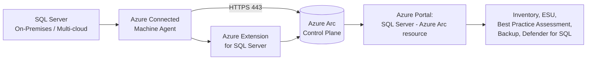
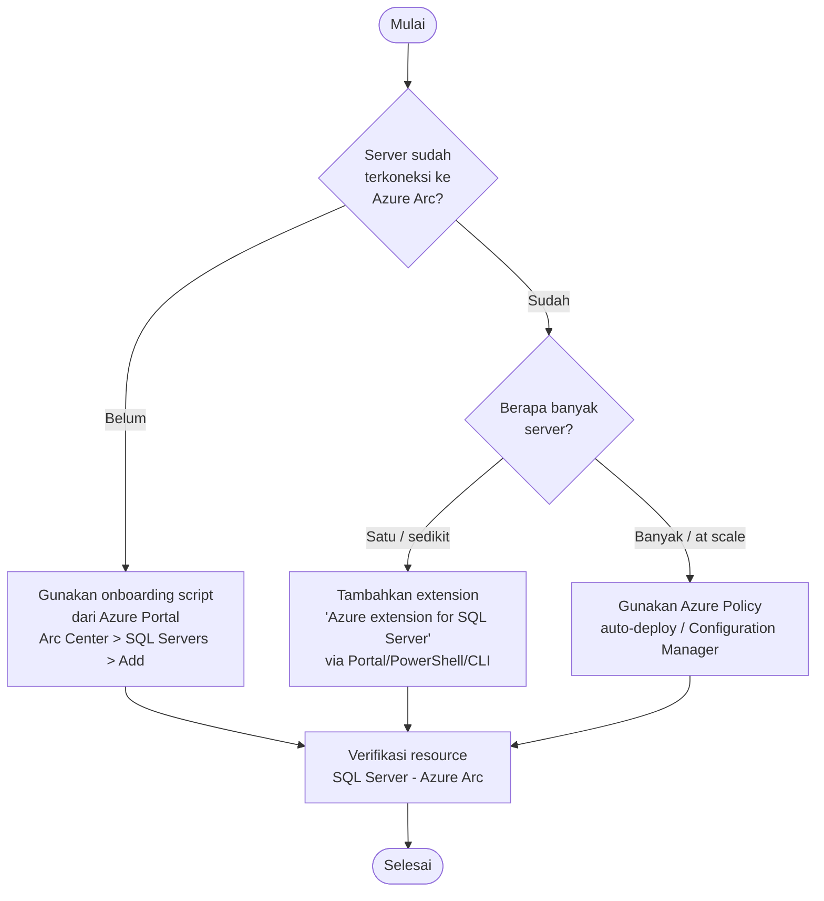
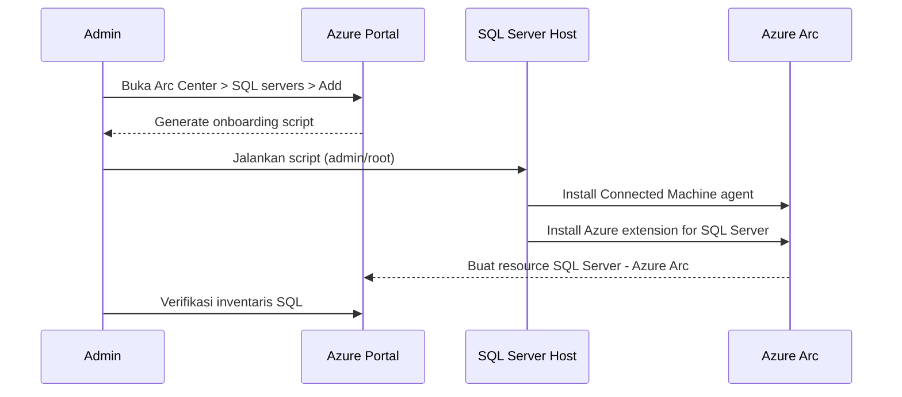

# Tutorial: Aktivasi Azure Arc-enabled SQL Server

Tutorial ini memandu Anda langkah demi langkah untuk **mengaktifkan (onboard) instance SQL Server** ke Azure agar dikelola sebagai resource Azure melalui **Azure Arc-enabled SQL Server**. Sumber referensi utama adalah dokumentasi resmi Microsoft Learn.

> Sumber utama: [SQL Server enabled by Azure Arc — overview](https://learn.microsoft.com/sql/sql-server/azure-arc/overview?view=sql-server-ver17)

---

## ⚠️ Disclaimer

- Materi ini disusun **untuk tujuan edukasi dan referensi belajar pribadi**, bukan dokumen resmi Microsoft.
- Seluruh konten dirangkum dari **Microsoft Learn** pada tanggal pembuatan dokumen. Karena layanan Azure (termasuk Azure Arc dan Azure extension for SQL Server) terus berkembang, **selalu verifikasi langkah, perintah, dan persyaratan terbaru pada [Microsoft Learn](https://learn.microsoft.com/sql/sql-server/azure-arc/)**.
- Contoh perintah PowerShell / Azure CLI / Kusto disediakan sebagai referensi. **Uji terlebih dahulu pada lingkungan non-produksi** sebelum diterapkan ke produksi.
- Penulis dan kontributor **tidak bertanggung jawab atas kerugian, downtime, biaya, atau dampak operasional** apa pun yang timbul akibat penggunaan materi ini.
- Penggunaan layanan Azure dapat menimbulkan biaya. Tinjau [Azure pricing](https://azure.microsoft.com/pricing/) dan ketentuan lisensi SQL Server Anda sebelum aktivasi.
- Sebagian materi (mis. *Azure extension for SQL Server* untuk Linux) dapat berstatus **preview** dan tidak direkomendasikan untuk beban kerja produksi.

---

## 1. Konsep Singkat

Azure Arc-enabled SQL Server memproyeksikan instance SQL Server (on-premises, edge, atau multi-cloud) sebagai resource Azure. Aktivasinya dilakukan dengan dua komponen utama:

1. **Azure Connected Machine agent** — menghubungkan server fisik/VM ke Azure Arc.
2. **Azure extension for SQL Server (`WindowsAgent.SqlServer` / `LinuxAgent.SqlServer`)** — mendeteksi instance SQL Server dan mendaftarkannya ke Azure.



Referensi: [Connect your SQL Server to Azure Arc](https://learn.microsoft.com/sql/sql-server/azure-arc/connect?view=sql-server-ver17)

---

## 2. Prasyarat

Sebelum aktivasi, pastikan hal berikut terpenuhi.

> Referensi: [Prerequisites - SQL Server enabled by Azure Arc](https://learn.microsoft.com/sql/sql-server/azure-arc/prerequisites?view=sql-server-ver17)

### 2.1 Akun & Subscription
- Azure subscription aktif.
- User / service principal memiliki minimal role **Azure Connected Machine Onboarding** + permission berikut pada resource group target:
  - `Microsoft.AzureArcData/register/action`
  - `Microsoft.HybridCompute/machines/extensions/read`
  - `Microsoft.HybridCompute/machines/extensions/write`
  - `Microsoft.Resources/deployments/validate/action`
- Atau gunakan built-in role **Contributor** / **Owner**.

### 2.2 Resource Provider
Daftarkan resource provider berikut pada subscription:
- `Microsoft.AzureArcData`
- `Microsoft.HybridCompute`

```powershell
az provider register --namespace Microsoft.AzureArcData
az provider register --namespace Microsoft.HybridCompute
```

### 2.3 Server & Jaringan
- OS Windows atau Linux yang [didukung](https://learn.microsoft.com/sql/sql-server/azure-arc/prerequisites?view=sql-server-ver17).
- Connected Machine agent berjalan dalam mode **full** (bukan minimal).
- Akses outbound HTTPS (443) ke endpoint Azure Arc — lihat [Network requirements](https://learn.microsoft.com/azure/azure-arc/servers/network-requirements).
- Region Azure yang dipilih harus [didukung](https://learn.microsoft.com/sql/sql-server/azure-arc/overview?view=sql-server-ver17#supported-azure-regions). Gunakan **region yang sama** untuk Arc-enabled Server dan Arc-enabled SQL Server.

### 2.4 Hak Akses Lokal
- Windows: anggota grup **Local Administrators**.
- Linux: akun **root**.

---

## 3. Alur Keputusan: Pilih Metode Aktivasi



Referensi: [Deployment options for SQL Server enabled by Azure Arc](https://learn.microsoft.com/sql/sql-server/azure-arc/deployment-options?view=sql-server-ver17)

---

## 4. Skenario A — Server Belum Ter-Onboard ke Azure Arc

Gunakan **onboarding script** yang menghubungkan server sekaligus memasang Azure extension for SQL Server.

> Referensi: [Connect your SQL Server to Azure Arc](https://learn.microsoft.com/sql/sql-server/azure-arc/connect?view=sql-server-ver17#onboard-the-server-to-azure-arc)

### Langkah-langkah
1. Buka [Azure Arc Center](https://portal.azure.com/#view/Microsoft_Azure_ArcCenterUX/ArcCenterMenuBlade/%7E/getStarted) di Azure Portal.
2. Pada **Data services**, pilih **SQL servers** → **+ Add**.
3. Pilih **Connect SQL Server instances**.
4. Tinjau prasyarat → **Next: Server details**.
5. Isi:
   - Subscription
   - Resource group
   - Region (sama dengan Arc-enabled Server)
   - Operating system (Windows / Linux)
   - Proxy (jika ada)
   - Server Name (opsional)
6. Pilih **SQL Server edition** dan **license type** (Paid / PAYG / LicenseOnly).
7. (Opsional) Daftar instance yang ingin **dikecualikan**, dipisahkan spasi.
8. Tinjau & generate **onboarding script**.
9. Jalankan script di server target sebagai administrator/root.



---

## 5. Skenario B — Server Sudah Ter-Onboard ke Azure Arc

Cukup tambahkan **Azure extension for SQL Server** pada machine resource yang sudah ada.

> Referensi: [Connect your SQL Server to Azure Arc on a server already enabled by Azure Arc](https://learn.microsoft.com/sql/sql-server/azure-arc/connect-already-enabled?view=sql-server-ver17)

### 5.1 Via Azure Portal
1. Buka **Azure Arc** → **Servers** → pilih server target.
2. Pilih **Extensions** → **+ Add**.
3. Pilih **Azure extension for SQL Server** → **Next**.
4. Pilih **SQL Server edition** dan **license type**.
5. (Opsional) Isi instance yang dikecualikan.
6. **Review + Create** → **Create**.

### 5.2 Via Azure CLI

```bash
az connectedmachine extension create \
  --machine-name "<arc-machine-name>" \
  --resource-group "<rg>" \
  --name "WindowsAgent.SqlServer" \
  --publisher "Microsoft.AzureData" \
  --type "WindowsAgent.SqlServer" \
  --location "<region>" \
  --settings '{ "SqlManagement": { "IsEnabled": true }, "LicenseType": "Paid" }'
```

> Untuk Linux, ganti `WindowsAgent.SqlServer` dengan `LinuxAgent.SqlServer`.
>
> **Catatan:** *Azure extension for SQL Server* untuk Linux saat ini berstatus **preview**. Lihat [Connect on a server already enabled by Arc](https://learn.microsoft.com/sql/sql-server/azure-arc/connect-already-enabled?view=sql-server-ver17).

### 5.3 Via PowerShell

```powershell
New-AzConnectedMachineExtension `
  -Name "WindowsAgent.SqlServer" `
  -ResourceGroupName "<rg>" `
  -MachineName "<arc-machine-name>" `
  -Location "<region>" `
  -Publisher "Microsoft.AzureData" `
  -ExtensionType "WindowsAgent.SqlServer" `
  -Setting @{ "SqlManagement" = @{ "IsEnabled" = $true }; "LicenseType" = "Paid" }
```

---

## 6. Skenario C — Aktivasi Otomatis untuk Banyak Server

Untuk lingkungan skala besar, Microsoft secara otomatis memasang Azure extension for SQL Server pada setiap machine baru yang terhubung ke Arc dan memiliki SQL Server.

> Referensi: [Manage automatic connection for SQL Server enabled by Azure Arc](https://learn.microsoft.com/sql/sql-server/azure-arc/manage-autodeploy?view=sql-server-ver17)

Proses otomatis akan:
1. Mendaftarkan resource provider `Microsoft.AzureArcData` (jika belum).
2. Mengatur **license type** (berdasarkan tag `ArcSQLServerExtensionDeployment`).
3. Memasang Azure extension for SQL Server.
4. Membuat resource **Arc-enabled SQL Server instance** di Azure.

Anda juga dapat menerapkan **Azure Policy**: *Subscribe eligible Arc-enabled SQL Servers instances to Extended Security Updates* untuk mengaktifkan ESU secara massal. Lihat [Configure SQL Server enabled by Azure Arc](https://learn.microsoft.com/sql/sql-server/azure-arc/manage-configuration?view=sql-server-ver17#subscribe-to-extended-security-updates-at-scale-by-using-azure-policy).

---

## 7. Verifikasi Aktivasi

Setelah onboarding, validasi melalui beberapa cara:

1. **Azure Portal** → **Azure Arc** → **SQL Servers** → pastikan resource muncul dengan status **Connected**.
2. **Azure Resource Graph** untuk audit license type:

```kusto
resources
| where type == "microsoft.azurearcdata/sqlserverinstances"
| project name, resourceGroup, location,
          edition = properties.edition,
          version = properties.version,
          licenseType = properties.licenseType,
          status = properties.status
```

3. Pada server target (Windows), pastikan service berikut berjalan:
   - `himds` (Hybrid Instance Metadata Service)
   - `ExtensionService`
   - Folder ekstensi: `C:\Program Files\AzureConnectedMachineAgent\ExtensionService\GC\Microsoft.AzureData.WindowsAgent.SqlServer`


Jika `licenseType` bernilai **Configuration needed**, perbaiki sesuai panduan [Configure SQL Server enabled by Azure Arc](https://learn.microsoft.com/sql/sql-server/azure-arc/manage-configuration?view=sql-server-ver17).

---

## 8. Pasca-Aktivasi: Fitur yang Bisa Diaktifkan

Setelah SQL Server ter-Arc, Anda dapat mengaktifkan:

| Fitur | Referensi |
|---|---|
| Best Practices Assessment | [Best practices assessment](https://learn.microsoft.com/sql/sql-server/azure-arc/assess?view=sql-server-ver17) |
| Microsoft Defender for SQL | [Defender for SQL](https://learn.microsoft.com/azure/defender-for-cloud/defender-for-sql-introduction) |
| Automated Backup ke Azure Storage | [Automated backup](https://learn.microsoft.com/sql/sql-server/azure-arc/backup-controlled?view=sql-server-ver17) |
| Extended Security Updates (ESU) | [SQL Server ESU enabled by Azure Arc](https://learn.microsoft.com/sql/sql-server/azure-arc/extended-security-updates?view=sql-server-ver17) |
| Microsoft Entra (Azure AD) Authentication | [Configure Entra auth](https://learn.microsoft.com/sql/sql-server/azure-arc/connected/azure-ad-authentication?view=sql-server-ver17) |
| Failover Cluster Instance support | [FCI support](https://learn.microsoft.com/sql/sql-server/azure-arc/support-for-fci?view=sql-server-ver17) |

---

## 9. Troubleshooting Singkat

| Gejala | Penyebab Umum | Tindakan |
|---|---|---|
| Extension state = **Failed** | Permission kurang / RP belum terdaftar | Daftarkan RP, cek role assignment |
| `LicenseType = Configuration needed` | Onboarding tidak punya info lisensi | Set manual via Portal/CLI |
| Resource SQL tidak muncul | Tidak ada instance terdeteksi / instance dikecualikan | Cek log `C:\Program Files\AzureExtensionForSQLServer\Log` |
| Gagal koneksi outbound | Firewall/Proxy memblokir | Verifikasi [network requirements](https://learn.microsoft.com/azure/azure-arc/servers/network-requirements) |

---

## 10. Referensi Microsoft Learn

- [SQL Server enabled by Azure Arc — Overview](https://learn.microsoft.com/sql/sql-server/azure-arc/overview?view=sql-server-ver17)
- [Prerequisites](https://learn.microsoft.com/sql/sql-server/azure-arc/prerequisites?view=sql-server-ver17)
- [Deployment options](https://learn.microsoft.com/sql/sql-server/azure-arc/deployment-options?view=sql-server-ver17)
- [Connect SQL Server to Azure Arc](https://learn.microsoft.com/sql/sql-server/azure-arc/connect?view=sql-server-ver17)
- [Connect on a server already enabled by Arc](https://learn.microsoft.com/sql/sql-server/azure-arc/connect-already-enabled?view=sql-server-ver17)
- [Manage automatic connection](https://learn.microsoft.com/sql/sql-server/azure-arc/manage-autodeploy?view=sql-server-ver17)
- [Configure SQL Server enabled by Azure Arc](https://learn.microsoft.com/sql/sql-server/azure-arc/manage-configuration?view=sql-server-ver17)
- [Extended Security Updates (ESU)](https://learn.microsoft.com/sql/sql-server/azure-arc/extended-security-updates?view=sql-server-ver17)
- [US Government region](https://learn.microsoft.com/sql/sql-server/azure-arc/us-government-region?view=sql-server-ver17)
- [Azure Connected Machine agent — network requirements](https://learn.microsoft.com/azure/azure-arc/servers/network-requirements)
