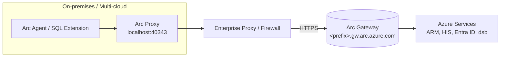
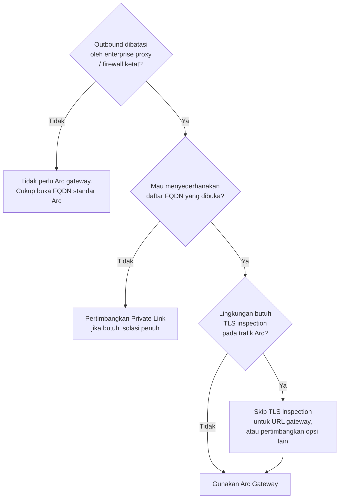
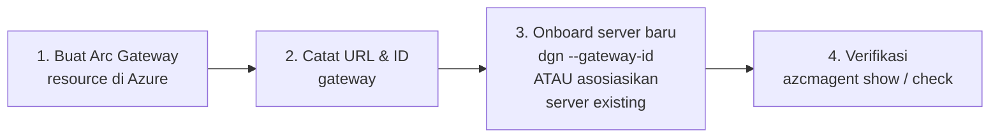

# Modul 12 — Azure Arc Gateway

Modul ini menjelaskan **Azure Arc gateway** secara mudah: apa itu, **kapan harus pakai**, dan **bagaimana mengaktifkannya** — khususnya pada konteks Arc-enabled servers yang menjadi fondasi **SQL Server enabled by Azure Arc**.

> Sumber utama: [Simplify network configuration requirements with Azure Arc gateway (servers)](https://learn.microsoft.com/azure/azure-arc/servers/arc-gateway)

---

## ⚠️ Disclaimer

Materi ini bersifat **edukasi**. Selalu verifikasi langkah dan endpoint terbaru ke [Microsoft Learn](https://learn.microsoft.com/azure/azure-arc/servers/arc-gateway) sebelum diterapkan ke produksi. Penggunaan Azure dapat menimbulkan biaya.

---

## 1. Apa Itu Azure Arc Gateway?

Azure Arc gateway adalah **resource Azure** yang berfungsi sebagai **pintu gerbang tunggal** (single front-door) untuk semua trafik outbound dari Arc agent ke Azure. Tanpa gateway, setiap Arc-enabled server harus mampu menjangkau **puluhan FQDN** Azure. Dengan gateway, jumlah FQDN yang perlu dibuka di firewall **berkurang drastis** (hanya beberapa endpoint inti + URL gateway Anda).

Dua komponen utama:

1. **Arc gateway resource** — resource di Azure dengan URL khusus berbentuk `<prefix>.gw.arc.azure.com`.
2. **Arc proxy** — komponen lokal di dalam Connected Machine agent yang berjalan sebagai forward proxy lokal di `http://localhost:40343`.



> Referensi diagram & komponen: [How the Azure Arc gateway works](https://learn.microsoft.com/azure/azure-arc/servers/arc-gateway)

---

## 2. Kapan Harus Pakai Arc Gateway?



### ✅ Cocok untuk skenario:
- **Enterprise dengan firewall/proxy ketat** dan butuh meminimalkan jumlah FQDN yang di-allow-list.
- **Audit trafik terpusat** — semua trafik Arc lewat satu gerbang.
- **Skala besar**: 1 gateway dapat melayani **±2.000 Arc-enabled server** per region (server only). Untuk Kubernetes only: **±1.000** per region. Lihat [planning](https://learn.microsoft.com/azure/azure-arc/servers/arc-gateway#plan-your-azure-arc-gateway-setup).
- **Azure Local (formerly Azure Stack HCI)** versi 2506+ — bahkan disarankan saat deployment.

### ❌ Tidak cocok / batasan:
- Hanya tersedia di **Azure public cloud** (bukan US Gov / China cloud).
- **Tidak direkomendasikan** jika environment **mewajibkan TLS termination/inspection** untuk endpoint Arc — kecuali Anda meng-skip inspection untuk URL gateway.
- Maksimal **5 Arc gateway resource per subscription**.
- Untuk Azure Local: gateway **harus dikonfigurasi saat deployment**, tidak bisa setelah deployment.

> Referensi batasan: [Current limitations](https://learn.microsoft.com/azure/azure-arc/kubernetes/arc-gateway-simplify-networking#current-limitations)

---

## 3. Hubungan dengan Arc-enabled SQL Server

Arc-enabled SQL Server berjalan **di atas Connected Machine agent**. Setelah server terkoneksi via Arc gateway, **Azure extension for SQL Server otomatis ikut menggunakan jalur gateway** (melalui Arc proxy lokal). Tidak ada konfigurasi tambahan khusus untuk extension SQL.

```mermaid
sequenceDiagram
    participant SQLExt as Azure Ext for SQL Server
    participant Agent as Connected Machine Agent
    participant Proxy as Arc Proxy (localhost:40343)
    participant GW as Arc Gateway
    participant Azure as Azure Control Plane

    SQLExt->>Agent: Telemetry / inventory / ESU
    Agent->>Proxy: HTTPS via local proxy
    Proxy->>GW: Forward via &lt;prefix&gt;.gw.arc.azure.com
    GW->>Azure: Route ke endpoint tujuan
    Azure-->>SQLExt: Response
```

---

## 4. Prasyarat

> Referensi: [arc-gateway — required permissions & URLs](https://learn.microsoft.com/azure/azure-arc/servers/arc-gateway)

- **Permission**: role **Azure Arc gateway manager** untuk membuat dan mengasosiasikan resource.
- **Connected Machine agent** versi terbaru (disarankan ≥ **1.51** agar asosiasi otomatis tanpa langkah manual).
- Endpoint berikut tetap **wajib di-allow** di firewall, di samping URL gateway Anda:

| URL | Tujuan |
|---|---|
| `<prefix>.gw.arc.azure.com` | URL gateway Anda (dapat dari `az arcgateway list`) |
| `management.azure.com` | Azure Resource Manager |
| `login.microsoftonline.com`, `<region>.login.microsoft.com` | Microsoft Entra ID |
| `gbl.his.arc.azure.com` | Cloud service endpoint Arc |
| `<region>.his.arc.azure.com` | Arc core control channel |
| `packages.microsoft.com` | Onboarding Linux |
| `download.microsoft.com` | Installer Windows |

---

## 5. Aktivasi Arc Gateway (Arc-enabled Servers)



### 5.1 Buat resource Arc gateway

**Azure CLI** (perlu extension `arcgateway`):

```bash
az extension add --name arcgateway

az arcgateway create \
  --name "arcgw-prod-eastus" \
  --resource-group "rg-arc" \
  --location "eastus"

# Ambil resource ID gateway
az arcgateway show -g rg-arc -n arcgw-prod-eastus --query id -o tsv
```

> Referensi: [Create the Arc gateway resource](https://learn.microsoft.com/azure/azure-arc/servers/arc-gateway#create-the-arc-gateway-resource)

### 5.2 Onboard server BARU dengan gateway

Gunakan flag `--gateway-id` pada `azcmagent connect`:

```powershell
azcmagent connect `
  --subscription-id "<sub-id>" `
  --resource-group  "rg-arc" `
  --location        "eastus" `
  --gateway-id      "/subscriptions/<sub-id>/resourceGroups/rg-arc/providers/Microsoft.HybridCompute/gateways/arcgw-prod-eastus"
```

> Referensi: [`azcmagent connect --gateway-id`](https://learn.microsoft.com/azure/azure-arc/servers/azcmagent-connect#flags)
>
> Tip: jika men-generate onboarding script di Portal, pilih **Public Endpoint** sebagai *Connectivity method* lalu pilih **Gateway Resource** dari dropdown.

### 5.3 Asosiasikan server EXISTING ke gateway

**Portal:** *Azure Arc → Azure Arc gateway → pilih gateway → Associated resources → Add → pilih server → Apply.*

**Azure CLI:**

```bash
az arcgateway settings update \
  --resource-group "rg-arc" \
  --subscription   "<sub-name-or-id>" \
  --base-provider  "Microsoft.HybridCompute" \
  --base-resource-type "machines" \
  --base-resource-name "<server-name>" \
  --gateway-resource-id "<gateway-resource-id>"
```

**PowerShell:**

```powershell
Update-AzArcSetting `
  -ResourceGroupName  "rg-arc" `
  -SubscriptionId     "<sub-id>" `
  -BaseProvider       "Microsoft.HybridCompute" `
  -BaseResourceType   "machine" `
  -BaseResourceName   "<server-name>" `
  -GatewayResourceId  "<gateway-resource-id>"
```

> Untuk agent versi ≤ **1.50**, jalankan tambahan: `azcmagent config set connection.type gateway`. Agent ≥ 1.51 melakukan ini otomatis. Lihat [Configure existing Azure Arc resources](https://learn.microsoft.com/azure/azure-arc/servers/arc-gateway#configure-existing-azure-arc-resources-to-use-azure-arc-gateway).

### 5.4 Verifikasi

```powershell
azcmagent show
azcmagent check
```

Pastikan:
- **Agent Status**: `Connected`
- **Using HTTPS Proxy**: `http://localhost:40343`
- **Upstream Proxy**: enterprise proxy Anda (jika ada), dengan URL gateway tampak
- `azcmagent check` → kolom **Reachable** = `true` untuk semua URL, dan `connection.type = gateway`

> Referensi: [Verify successful Azure Arc gateway setup](https://learn.microsoft.com/azure/azure-arc/servers/arc-gateway#verify-successful-azure-arc-gateway-setup)

---

## 6. Catatan Khusus untuk Azure Local

Jika lingkungan Anda **Azure Local (Azure Stack HCI) ≥ 2506**, Arc gateway harus diaktifkan **saat deployment** (tidak bisa setelahnya). Lihat:

- [About Azure Arc gateway for Azure Local](https://learn.microsoft.com/azure/azure-local/deploy/deployment-azure-arc-gateway-overview)
- [Register Azure Local with Arc using Arc gateway](https://learn.microsoft.com/azure/azure-local/deploy/deployment-with-azure-arc-gateway)

---

## 7. Ringkasan Cepat

| Pertanyaan | Jawaban |
|---|---|
| Apa fungsinya? | Mengurangi jumlah FQDN outbound yang perlu dibuka untuk Arc |
| Apakah wajib? | Tidak — opsional. Wajib hanya untuk skenario tertentu (mis. Azure Local 2506+) |
| Berdampak ke Arc-enabled SQL? | Ya secara tidak langsung — SQL extension ikut lewat gateway |
| Cloud yang didukung | Azure public cloud saja |
| Limit per subscription | 5 gateway resource |
| Flag onboarding | `azcmagent connect --gateway-id <id>` |

---

## 8. Referensi Microsoft Learn

- [Simplify network configuration with Azure Arc gateway (servers)](https://learn.microsoft.com/azure/azure-arc/servers/arc-gateway)
- [`azcmagent connect` reference](https://learn.microsoft.com/azure/azure-arc/servers/azcmagent-connect)
- [Arc gateway for Arc-enabled Kubernetes](https://learn.microsoft.com/azure/azure-arc/kubernetes/arc-gateway-simplify-networking)
- [Arc gateway for Azure Local — overview](https://learn.microsoft.com/azure/azure-local/deploy/deployment-azure-arc-gateway-overview)
- [Register Azure Local with Arc gateway](https://learn.microsoft.com/azure/azure-local/deploy/deployment-with-azure-arc-gateway)
- [Connected Machine agent — network requirements](https://learn.microsoft.com/azure/azure-arc/servers/network-requirements)
